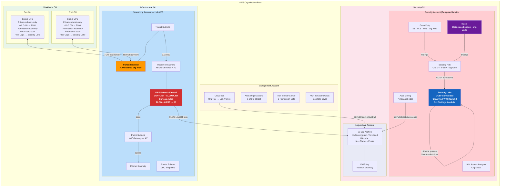
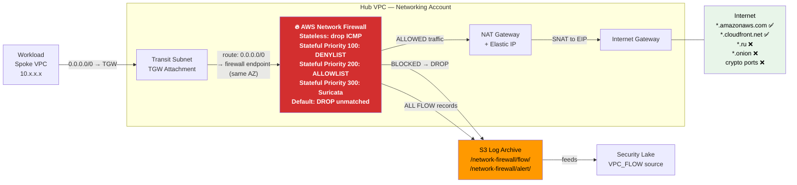
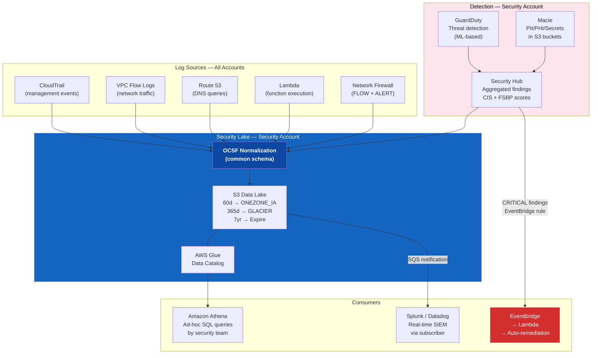
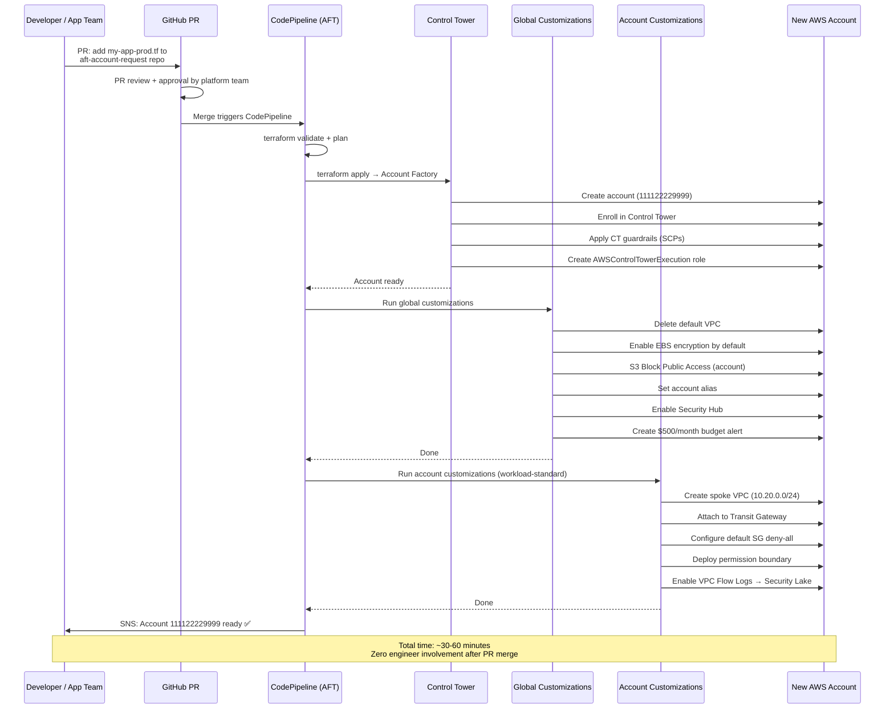
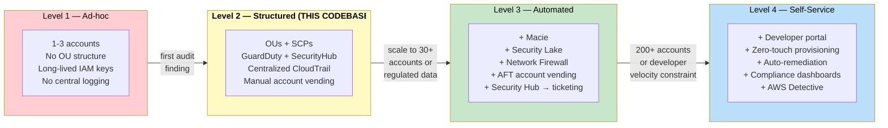

# Enterprise AWS Landing Zone Supplement

> **Extends:** `LANDING_ZONE_GUIDE.md`
> **Covers:** Industry patterns · AFT account vending · Macie · Security Lake · Network Inspection
> **New modules added:** `modules/macie` · `modules/security-lake` · `modules/network-inspection`

---

## Table of Contents

1. [How Enterprises Structure Their Landing Zones](#1-how-enterprises-structure-their-landing-zones)
2. [Automated Account Vending with AFT](#2-automated-account-vending-with-aft)
3. [Amazon Macie — Data Classification](#3-amazon-macie--data-classification)
4. [AWS Security Lake — Long-Term Findings Retention](#4-aws-security-lake--long-term-findings-retention)
5. [Network Inspection Layer](#5-network-inspection-layer)
6. [Updated Architecture — All Components](#6-updated-architecture--all-components)
7. [Deployment Order — Full Stack](#7-deployment-order--full-stack)

---

## 1. How Enterprises Structure Their Landing Zones

### 1.1 Maturity Model

Organizations progress through four levels. Most land at Level 2 before a compliance driver forces Level 3 or 4.

```
Level 1 — Ad-hoc (< 10 accounts)
  • 1–3 accounts, no OU structure
  • Long-lived IAM users, access keys in CI/CD
  • No centralized logging
  • Trigger to fix: first security incident or audit finding

Level 2 — Structured (10–50 accounts)
  • OUs exist, some SCPs
  • Manual account creation (terraform apply per account)
  • GuardDuty enabled, findings go nowhere
  • This codebase sits here on arrival

Level 3 — Automated (50–200 accounts)
  • AFT or equivalent pipeline for account vending
  • Security Hub findings → ticketing system
  • CloudTrail → SIEM
  • Network inspection for regulated traffic
  • Macie for data classification

Level 4 — Self-service (200+ accounts)
  • Developer portal (Backstage/Service Catalog)
  • Zero-touch account provisioning
  • Automated remediation for Config/SecurityHub findings
  • Security Lake as the centralized data plane
  • Full compliance posture dashboards
```

---

### 1.2 OU Patterns by Industry

#### Technology Companies (Spotify, Stripe, Atlassian model)
```
Root
├── Security
│   ├── Security          ← GuardDuty, SecurityHub, Macie, Security Lake
│   └── Log Archive        ← 7-year WORM + lifecycle to Glacier
├── Infrastructure
│   ├── Network            ← Hub VPC, TGW, Inspection layer
│   └── Shared Services    ← ECR, Artifactory, CI/CD
├── Workloads
│   ├── Dev
│   ├── Staging
│   └── Prod
└── Sandbox                ← Spend-capped, relaxed SCPs
```
**Key characteristics:** Full Terraform, GitOps account vending, OIDC everywhere, per-microservice accounts at scale.

#### Financial Services (Capital One, banking model)
```
Root
├── Security
│   ├── Security Tooling   ← GuardDuty, SecurityHub, Macie, Detective
│   ├── Log Archive        ← Object Lock (WORM), 7-year retention
│   └── Forensics          ← Isolated, rarely accessed
├── Infrastructure
│   ├── Network-DMZ        ← Internet-facing, inspection VPCs
│   ├── Network-Internal   ← Internal TGW hub
│   └── Shared Services
├── Workloads
│   ├── PCI-Scoped         ← Cardholder data — strictest SCPs, Macie mandatory
│   ├── HIPAA-Scoped       ← PHI — Macie + encryption enforcement
│   ├── Internal           ← Standard internal apps
│   └── Internet-Facing    ← Customer-facing, behind WAF
├── SDLC
│   ├── Dev
│   ├── Test
│   └── UAT
└── Sandbox
```
**Key additions:** S3 Object Lock WORM on log archive, Network Firewall + GWLB with Palo Alto, HSM instead of KMS, Macie org-wide.

#### Healthcare (HIPAA/HITRUST model)
```
Root
├── Security
│   ├── Security           ← Detective controls delegated admin
│   └── Log Archive        ← HIPAA-compliant, 6-year retention
├── Infrastructure
│   ├── Network
│   └── Shared Services
├── PHI-Workloads          ← All accounts here have HIPAA BAA
│   ├── PHI-Prod
│   └── PHI-DR
├── Non-PHI-Workloads
│   ├── Analytics          ← De-identified data only
│   └── Dev-Test
└── Sandbox
```
**Key additions:** VPC endpoints for every AWS service used (zero internet), Macie for PHI detection, Security Hub HIPAA standard.

#### Government / Public Sector (LZA model)
```
Root
├── Security
├── Infrastructure
├── Regulated              ← FedRAMP, CJIS, ITAR
│   ├── Regulated-Prod
│   └── Regulated-Dev
├── Unclassified
└── Sandbox
```
**Key difference:** Uses AWS Landing Zone Accelerator (LZA), not Terraform directly. Config driven by `config.yaml`, enforces NIST 800-53 control mappings.

---

### 1.3 What the Most Mature Organizations Add to This Codebase

| Capability | Tool | Why |
|---|---|---|
| Data classification | Macie | Identify where sensitive data lives before you can protect it |
| Long-term security analytics | Security Lake | Normalized OCSF format, queryable via Athena, feeds SIEM |
| Network traffic inspection | Network Firewall / GWLB | Detect and block malicious egress, enforce allowlists |
| Account vending automation | AFT | Scale beyond ~30 accounts without manual intervention |
| Automated remediation | Security Hub → EventBridge → Lambda | Auto-revoke public S3, auto-quarantine compromised IAM keys |
| Developer self-service | Backstage / Service Catalog | Remove platform team as bottleneck for new accounts |
| Forensics capability | AWS Detective | Graph-based investigation of GuardDuty findings |
| Budget guardrails | AWS Budgets + SNS | Prevent runaway costs per account |

---

## 2. Automated Account Vending with AFT

### 2.1 What AFT Is

AWS Account Factory for Terraform (AFT) is an AWS-maintained Terraform module that builds a GitOps pipeline for account provisioning on top of AWS Control Tower. A developer submits a pull request — AFT handles the rest.

```
Git PR submitted
      │
      ▼ CodePipeline triggers
  ┌───────────────────────────────────────────┐
  │  1. Terraform validate + plan              │
  │  2. Approval gate (optional)               │
  │  3. terraform apply                        │
  │     └─► Control Tower Account Factory      │
  │          • Creates AWS account             │
  │          • Enrolls in Control Tower        │
  │          • Applies CT guardrails (SCPs)    │
  │          • Creates access roles            │
  │  4. AFT Global Customizations              │
  │     └─► Runs on EVERY new account          │
  │          • Delete default VPC              │
  │          • EBS encryption default         │
  │          • S3 public access block          │
  │          • Baseline IAM roles              │
  │  5. AFT Account Customizations             │
  │     └─► Runs based on account_type tag     │
  │          • Spoke VPC + TGW attachment      │
  │          • App-specific IAM roles          │
  │          • Permission boundaries           │
  └───────────────────────────────────────────┘
      │
      ▼ SNS notification
  "Account 111122229999 (my-app-prod) ready"
```

### 2.2 AFT Module Setup

```hcl
# In management account — new terraform root config: platform/aft-setup/main.tf

module "aft" {
  source  = "aws-ia/control_tower_account_factory/aws"
  version = "~> 1.12"

  # Core account IDs
  ct_management_account_id  = var.management_account_id
  log_archive_account_id    = var.log_archive_account_id
  audit_account_id          = var.security_account_id
  aft_management_account_id = var.aft_management_account_id  # new dedicated account

  ct_home_region              = "ap-southeast-2"
  tf_backend_secondary_region = "ap-southeast-1"

  # Terraform config
  terraform_version      = "1.10.0"
  terraform_distribution = "oss"

  # Point at your GitHub repos
  vcs_provider = "github"
  account_request_repo_name                     = "myorg/aft-account-request"
  account_request_repo_branch                   = "main"
  global_customizations_repo_name               = "myorg/aft-global-customizations"
  account_customizations_repo_name              = "myorg/aft-account-customizations"
  account_provisioning_customizations_repo_name = "myorg/aft-account-provisioning-customizations"

  # Telemetry (set false to opt out)
  aft_feature_cloudtrail_data_events          = true
  aft_feature_enterprise_support              = false
  aft_feature_delete_default_vpcs_enabled     = true
}
```

### 2.3 Account Request Repository

One `.tf` file per account. A PR to add a file = a request for a new account.

```hcl
# aft-account-request/accounts/my-app-prod.tf

module "my_app_prod" {
  source = "./modules/aft-account-request"

  control_tower_parameters = {
    AccountEmail              = "my-app-prod@myorg.com"
    AccountName               = "myorg-my-app-prod"
    ManagedOrganizationalUnit = "Workloads/Prod"
    SSOUserEmail              = "platform-team@myorg.com"
    SSOUserFirstName          = "Platform"
    SSOUserLastName           = "Team"
  }

  account_tags = {
    "Application"  = "my-app"
    "Environment"  = "prod"
    "Owner"        = "app-team@myorg.com"
    "CostCenter"   = "CC-1234"
    "DataClass"    = "confidential"   # drives Macie scan frequency
  }

  change_management_parameters = {
    change_requested_by = "app-team"
    change_reason       = "Production account for my-app v2 launch"
  }

  # These become TF_VAR_ environment variables in account customizations
  custom_fields = {
    account_type       = "workload-standard"
    spoke_vpc_cidr     = "10.20.0.0/24"
    transit_gateway_id = "tgw-0abc1234def56789"
    az_count           = "2"
    enable_inspection  = "true"       # routes through network firewall
  }
}
```

### 2.4 Global Customizations (runs on every account)

```hcl
# aft-global-customizations/terraform/main.tf

# 1. Delete default VPC — reduces attack surface
resource "aws_default_vpc" "delete" {
  force_destroy = true
}

# 2. Enable EBS encryption by default
resource "aws_ebs_encryption_by_default" "this" {
  enabled = true
}

# 3. S3 Block Public Access at account level
resource "aws_s3_account_public_access_block" "this" {
  block_public_acls       = true
  block_public_policy     = true
  ignore_public_acls      = true
  restrict_public_buckets = true
}

# 4. Human-readable account alias
resource "aws_iam_account_alias" "this" {
  account_alias = var.account_name  # injected by AFT from AccountName
}

# 5. Enable Security Hub (aggregated to security account automatically)
resource "aws_securityhub_account" "this" {
  enable_default_standards = false
}

# 6. Budget alert — every account gets a $500/month alert
resource "aws_budgets_budget" "monthly" {
  name         = "monthly-account-budget"
  budget_type  = "COST"
  limit_amount = "500"
  limit_unit   = "USD"
  time_unit    = "MONTHLY"

  notification {
    comparison_operator        = "GREATER_THAN"
    threshold                  = 80
    threshold_type             = "PERCENTAGE"
    notification_type          = "FORECASTED"
    subscriber_email_addresses = [var.account_owner_email]
  }
}
```

### 2.5 Account Customizations — Workload Standard

This maps directly to `workloads/template/` from the base codebase:

```hcl
# aft-account-customizations/workload-standard/terraform/main.tf

locals {
  spoke_vpc_cidr     = var.spoke_vpc_cidr       # from AFT custom_fields
  transit_gateway_id = var.transit_gateway_id
  enable_inspection  = var.enable_inspection == "true"
}

# Spoke VPC (same as workloads/template)
resource "aws_vpc" "spoke" {
  cidr_block           = local.spoke_vpc_cidr
  enable_dns_hostnames = true
  enable_dns_support   = true
  tags                 = { Name = "${var.account_name}-spoke-vpc" }
}

# ... subnets, TGW attachment, route tables (same as workloads/template/main.tf)

# Conditional: route through inspection firewall endpoint if enabled
resource "aws_route" "default" {
  route_table_id         = aws_route_table.private.id
  destination_cidr_block = "0.0.0.0/0"
  transit_gateway_id     = local.transit_gateway_id
}
```

### 2.6 AFT vs Current Manual Process

| | Current (Level 2) | With AFT (Level 3) |
|---|---|---|
| How to request | Edit `tfvars`, run `terraform apply` | Open a GitHub PR |
| Approval workflow | Whoever has CLI credentials | PR review + merge gates |
| Time to ready | 30+ min, engineer required | 30–60 min, fully automated |
| Audit trail | Terraform state | Git history + CodePipeline logs + CT events |
| Consistency | Depends on the engineer running it | Guaranteed — same pipeline always |
| Self-service | No | Yes — teams PR their own accounts |
| Control Tower guardrails | No | Yes — auto-enrolled |
| Scale | Painful above 30 accounts | Linear — one file per account |

---

## 3. Amazon Macie — Data Classification

### 3.1 What Macie Does

Amazon Macie uses machine learning to **automatically discover, classify, and protect sensitive data** stored in S3. It answers the question: *"Where is our sensitive data, and is it exposed?"*

```
Macie scans S3 buckets across all accounts
            │
            ▼
  Runs 100+ Managed Data Identifiers (MDIs):
  ┌─────────────────────────────────────────┐
  │ Financial:  Credit card numbers         │
  │             Bank account numbers        │
  │             AWS secret/access keys      │
  │ PII:        Name + address + DOB combos │
  │             Passport numbers            │
  │             NZ IRD numbers              │
  │ Healthcare: Medical record numbers      │
  │             Health plan beneficiary IDs │
  │ Credentials: Passwords, API keys        │
  │             Private keys (RSA, PEM)     │
  └─────────────────────────────────────────┘
            │
            ▼
  Findings → Security Hub → EventBridge → Slack/Ticket
  Findings → Security Lake (OCSF format)
```

### 3.2 Macie Module — `modules/macie/`

See `modules/macie/main.tf` for full Terraform code.

**Key design decisions in the module:**

- **Split-account provider** (`aws.security` alias) — same pattern as GuardDuty/SecurityHub. Delegated admin registration runs in management account; all other Macie resources run in the security account.
- **Auto-enable for new accounts** — `aws_macie2_organization_configuration.auto_enable = true` ensures every new account AFT provisions is automatically scanned.
- **Scheduled classification jobs** — Weekly scans of the log archive bucket and any buckets tagged `DataClass = confidential | restricted`.
- **Findings filter** — Surfaces only HIGH and CRITICAL findings to reduce noise during initial adoption. Tune down to MEDIUM once baselines are established.
- **Custom Data Identifiers** — Add organisation-specific patterns (e.g., NZ IRD numbers, internal employee IDs) via `aws_macie2_custom_data_identifier`.

**Adding NZ IRD number detection:**
```hcl
resource "aws_macie2_custom_data_identifier" "nz_ird" {
  provider       = aws.security
  name           = "NZ-IRD-Number"
  regex          = "\\b[0-9]{8,9}\\b"
  keywords       = ["IRD", "tax number", "Inland Revenue"]
  maximum_match_distance = 50
  description    = "New Zealand IRD tax numbers"
  tags           = var.tags
}
```

### 3.3 Macie Integration with Security Hub

Macie findings automatically flow into Security Hub when both are enabled in the same account. This gives you a single pane of glass:

```
Macie Finding (CRITICAL — exposed S3 bucket with credit card numbers)
    │
    ▼ automatic integration
Security Hub Finding
    │
    ▼ EventBridge rule
Lambda function
    ├── Posts to Slack: "#security-alerts" channel
    ├── Creates Jira ticket with finding details
    └── Optionally: puts S3 bucket in quarantine (block public access)
```

**EventBridge rule for automated response:**
```hcl
resource "aws_cloudwatch_event_rule" "macie_critical" {
  name        = "${var.name_prefix}-macie-critical-findings"
  description = "Trigger on Macie CRITICAL findings"

  event_pattern = jsonencode({
    source      = ["aws.macie"]
    detail-type = ["Macie Finding"]
    detail = {
      severity = { description = ["Critical", "High"] }
    }
  })
}

resource "aws_cloudwatch_event_target" "macie_sns" {
  rule      = aws_cloudwatch_event_rule.macie_critical.name
  target_id = "SendToSNS"
  arn       = aws_sns_topic.security_alerts.arn
}
```

### 3.4 Where Macie Fits in the Platform

```
Platform accounts where Macie runs:
  Security Account (delegated admin)
    • Aggregates findings from all accounts
    • Runs classification jobs on log archive
    • Custom data identifiers defined here

  Log Archive Account
    • Macie scans centralized S3 log bucket weekly
    • Detects if CloudTrail logs accidentally contain credentials

  Every Workload Account (auto-enabled via org config)
    • Macie monitors all S3 buckets automatically
    • Findings sent to Security Hub in security account
```

---

## 4. AWS Security Lake — Long-Term Findings Retention

### 4.1 What Security Lake Is

AWS Security Lake is a purpose-built security data lake that:

1. **Normalises** all security log sources into **OCSF (Open Cybersecurity Schema Framework)** — a standard format every SIEM understands
2. **Centralises** logs from CloudTrail, VPC Flow Logs, Route 53, Security Hub findings, Lambda, and Macie into a single S3 bucket in your account
3. **Makes data queryable** via Amazon Athena — no SIEM needed for ad-hoc investigation
4. **Feeds your SIEM** via subscriber notifications — Splunk, Datadog, CrowdStrike all have native Security Lake integrations

```
Data Sources                  Security Lake              Consumers
────────────                  ─────────────              ─────────
CloudTrail (all accounts) ──►                        ┌─► Athena queries
VPC Flow Logs (all accts) ──► OCSF Normalisation    │   (ad-hoc forensics)
Route 53 DNS logs         ──► ─────────────────── ──┤
Security Hub findings     ──► S3 bucket in          ├─► Splunk / Datadog
Lambda execution logs     ──► security account      │   (real-time SIEM)
Macie findings            ──►                        │
GuardDuty findings        ──►                        └─► Security Lake
Custom sources (on-prem)  ──►                            Subscriber
                                                         (cross-account)
```

### 4.2 Why Security Lake Instead of Raw S3 CloudTrail

| | Raw CloudTrail S3 (current) | Security Lake |
|---|---|---|
| Format | JSON (CloudTrail-specific) | OCSF (universal standard) |
| Query tool | S3 Select, Athena + custom schema | Athena with pre-built OCSF schema |
| SIEM integration | Manual ETL per SIEM vendor | Native subscriber model |
| Cross-source correlation | Manual JOIN across files | Single normalized schema |
| Retention tiers | Manual lifecycle rules | Built-in configurable lifecycle |
| New log sources | Separate pipelines | Add one line of Terraform |
| Cost | S3 storage only | S3 + Lambda processing overhead |

### 4.3 Security Lake Module — `modules/security-lake/`

See `modules/security-lake/main.tf` for full Terraform code.

**Log sources enabled by the module:**

| Source Name | What it captures | OCSF Category |
|---|---|---|
| `CLOUD_TRAIL_MGMT` | All management API calls across org | API Activity |
| `CLOUD_TRAIL_S3` | S3 data plane events | API Activity |
| `VPC_FLOW` | Network flow records from all VPCs | Network Activity |
| `SH_FINDINGS` | All Security Hub findings (incl. GuardDuty, Macie) | Security Finding |
| `ROUTE53` | DNS resolver query logs | DNS Activity |
| `LAMBDA_EXECUTION` | Lambda function invocation logs | Application Activity |

**Lifecycle configuration (cost optimisation):**
```
Day 0–60:    S3 STANDARD          (hot — recent incidents)
Day 60–365:  S3 ONEZONE_IA        (warm — quarterly reviews)
Day 365+:    S3 GLACIER           (cold — compliance retention)
Day 2555+:   Expire               (7-year default, configurable)
```

### 4.4 Querying Security Lake with Athena

Once Security Lake is running, your security team can query across all accounts and all log types in a single SQL statement:

```sql
-- Find all IAM role assumptions in the last 24 hours across all accounts
SELECT
  time,
  cloud.account_uid AS account_id,
  actor.user.name AS assumed_by,
  resources[1].uid AS role_arn,
  src_endpoint.ip AS source_ip
FROM amazon_security_lake_glue_db_ap_southeast_2.amazon_security_lake_table_ap_southeast_2_cloud_trail_mgmt_2_0
WHERE
  eventday >= DATE_FORMAT(NOW() - INTERVAL '1' DAY, '%Y%m%d')
  AND api.operation = 'AssumeRole'
ORDER BY time DESC;

-- Find all CRITICAL Security Hub findings in the last 7 days
SELECT
  time,
  cloud.account_uid AS account_id,
  finding.title,
  finding.severity,
  resources[1].uid AS affected_resource
FROM amazon_security_lake_glue_db_ap_southeast_2.amazon_security_lake_table_ap_southeast_2_sh_findings_1_0
WHERE
  eventday >= DATE_FORMAT(NOW() - INTERVAL '7' DAY, '%Y%m%d')
  AND finding.severity = 'CRITICAL'
ORDER BY time DESC;
```

### 4.5 SIEM Subscriber Integration

```hcl
# Add a Splunk subscriber (Splunk pulls from S3 via SQS notifications)
resource "aws_securitylake_subscriber" "splunk" {
  subscriber_name = "splunk-prod"
  access_types    = ["S3"]

  sources {
    aws_log_source_resource {
      source_name    = "CLOUD_TRAIL_MGMT"
      source_version = "2"
    }
  }
  sources {
    aws_log_source_resource {
      source_name    = "SH_FINDINGS"
      source_version = "1"
    }
  }

  subscriber_identity {
    # Splunk's AWS account ID for the Security Lake integration
    principal   = "806177116456"          # Splunk's published account ID
    external_id = var.splunk_external_id  # from Splunk console
  }
}
```

---

## 5. Network Inspection Layer

### 5.1 Why You Need Network Inspection

The current hub-spoke model routes all egress through hub NAT gateways — but there is **no traffic inspection**. Traffic from a compromised workload can reach any internet destination. For regulated industries, this is a compliance gap.

```
Current flow (no inspection):
  Workload → TGW → Hub private subnet → NAT GW → Internet
                                ↑
                    No visibility here — any destination allowed

With inspection:
  Workload → TGW → Inspection subnet → Network Firewall → NAT GW → Internet
                              ↑                    ↑
                    All traffic inspected   Blocked domains dropped
                    FLOW + ALERT logs       Allowed: *.amazonaws.com, etc.
```

### 5.2 Two Inspection Patterns

#### Pattern A — AWS Network Firewall (L3/L4/L7, stateful, Suricata rules)

Best for: organizations that want AWS-native, no third-party licensing.

```
Hub VPC
├── Public Subnets       ← NAT Gateways (unchanged)
├── Private Subnets      ← VPC Endpoints (unchanged)
├── Inspection Subnets   ← AWS Network Firewall endpoints (NEW)
└── Transit Subnets      ← TGW attachment (unchanged)

Traffic flow:
  TGW attachment receives packet
       │
       ▼ route table: 0.0.0.0/0 → Firewall Endpoint
  Network Firewall (stateful inspection)
       │ pass                    │ block
       ▼                         ▼
  Private Subnet → NAT GW    Drop + ALERT log
       │
       ▼
  Internet
```

#### Pattern B — Gateway Load Balancer + Third-Party Appliance

Best for: organizations already using Palo Alto, Fortinet, or Check Point on-premises and want consistent policy.

```
Hub VPC
└── GWLB Endpoint        ← receives traffic from TGW
       │
       ▼ GENEVE tunnel
  Inspection VPC (separate)
  └── Palo Alto / Fortinet VM-Series
       │ pass             │ block
       ▼                  ▼
  Return to hub       Drop + alert
```

This codebase implements **Pattern A** — AWS Network Firewall. See `modules/network-inspection/` for the full Terraform module.

### 5.3 Network Inspection Module — `modules/network-inspection/`

See `modules/network-inspection/main.tf` for full Terraform code.

**What the module creates:**

| Resource | Purpose |
|---|---|
| `aws_networkfirewall_firewall_policy` | Container for all rule groups; defines default actions |
| `aws_networkfirewall_rule_group` (block-domains) | DENYLIST of known malicious domains using Suricata domain matching |
| `aws_networkfirewall_rule_group` (allow-aws) | ALLOWLIST for AWS service endpoints — *.amazonaws.com |
| `aws_networkfirewall_rule_group` (stateless-drop-icmp) | Drop all ICMP echo (ping) from workloads to internet |
| `aws_networkfirewall_firewall` | The actual firewall, deployed in inspection subnets |
| `aws_networkfirewall_logging_configuration` | FLOW logs and ALERT logs → S3 log archive |
| Inspection subnets | New /28 subnets in hub VPC, one per AZ, for firewall endpoints |
| Route table updates | Transit subnets route 0.0.0.0/0 → firewall endpoint; firewall routes to NAT |

**Firewall rule logic:**
```
Packet arrives from TGW
    │
    ▼ Stateless rules (fast path)
  • Drop ICMP echo to internet  ─────────────────► DROP
  • All else: forward to stateful engine
    │
    ▼ Stateful rules (STRICT_ORDER — priority 100 first)
  Priority 100: DENYLIST
  • *.ru, *.cn (configurable blocked TLDs)
  • Known C2 domains
  • Crypto mining pools          ─────────────────► DROP + ALERT
    │ not blocked
    ▼ Priority 200: ALLOWLIST
  • *.amazonaws.com
  • *.cloudfront.net
  • *.awsstatic.com
  • var.allowed_domains           ─────────────────► PASS
    │ not in allowlist
    ▼ Default action
  • DROP all other outbound       ─────────────────► DROP
  (or PASS all, depending on var.default_action)
```

### 5.4 Updating the Hub VPC for Inspection

When `modules/network-inspection` is added to `plz-networking`, the route tables in the hub VPC change:

```
Before (no inspection):
  Transit subnet RT:
    0.0.0.0/0 → (no route — TGW uses private route table)
  Private subnet RT:
    0.0.0.0/0 → NAT Gateway

After (with inspection):
  Transit subnet RT:
    0.0.0.0/0 → Firewall Endpoint (in same AZ)
  Firewall subnet RT:
    0.0.0.0/0 → NAT Gateway (in same AZ)
  Private subnet RT:
    0.0.0.0/0 → NAT Gateway (direct — private subnet traffic already inside hub)
  NAT subnet RT:
    Return traffic 10.0.0.0/8 → Firewall Endpoint (for asymmetric routing fix)
```

**Important:** AWS Network Firewall is AZ-specific — the firewall endpoint in AZ-a must be used by traffic originating from TGW subnets in AZ-a. Never route across AZs through the firewall (causes asymmetric routing failures).

### 5.5 Regulated Workload Routing

For PCI/HIPAA workloads that need full inspection AND allowlist-only egress:

```hcl
# In workloads/my-app-prod/main.tf
# Set a stricter TGW route table via a custom association

resource "aws_ec2_transit_gateway_route_table" "regulated" {
  transit_gateway_id = var.transit_gateway_id
  tags = { Name = "regulated-rt", Inspection = "strict" }
}

resource "aws_ec2_transit_gateway_route_table_association" "regulated" {
  transit_gateway_attachment_id  = aws_ec2_transit_gateway_vpc_attachment.spoke.id
  transit_gateway_route_table_id = aws_ec2_transit_gateway_route_table.regulated.id
}

# Route all traffic through hub inspection VPC
resource "aws_ec2_transit_gateway_route" "regulated_default" {
  destination_cidr_block         = "0.0.0.0/0"
  transit_gateway_attachment_id  = var.hub_tgw_attachment_id
  transit_gateway_route_table_id = aws_ec2_transit_gateway_route_table.regulated.id
}
```

---

## 6. Updated Architecture — All Components

```
┌─────────────────────────────────────────────────────────────────────────────────┐
│  AWS Organization                                                               │
│                                                                                 │
│  Management Account                                                             │
│  ├── AWS Organizations (SCPs: 5 at root)                                       │
│  ├── IAM Identity Center (5 permission sets)                                   │
│  ├── HCP Terraform OIDC Provider                                               │
│  └── CloudTrail Org Trail ──────────────────────────────────────────┐          │
│                                                                      │          │
│  Security OU                                                         │          │
│  ├── Security Account                                                │          │
│  │   ├── GuardDuty (delegated admin, S3+EKS+EBS features)           │          │
│  │   ├── Security Hub (CIS 1.4, FSBP, auto-enable all accounts)     │          │
│  │   ├── Macie (delegated admin, auto-enable, weekly scans)   ───────────┐     │
│  │   ├── IAM Access Analyzer (ORGANIZATION)                    │    │    │     │
│  │   ├── AWS Config (recorder, 7 rules, SNS notifications)     │    │    │     │
│  │   └── Security Lake ◄──────────────────────────────────────┘    │    │     │
│  │       ├── CLOUD_TRAIL_MGMT (all accounts)                        │    │     │
│  │       ├── VPC_FLOW (all accounts)                                │    │     │
│  │       ├── SH_FINDINGS                                            │    │     │
│  │       ├── ROUTE53                                                │    │     │
│  │       └── LAMBDA_EXECUTION                                       │    │     │
│  │           └─► Athena queries / Splunk subscriber                 │    │     │
│  │                                                                  │    │     │
│  └── Log Archive Account                                            │    │     │
│      └── S3: centralized-logs ◄─────────────────────────────────────────┘     │
│          ├── /cloudtrail/    (KMS-encrypted, versioned)             │          │
│          ├── /aws-config/    (lifecycle: IA→Glacier→Expire)         │          │
│          ├── /network-firewall/flow/   (NEW)                        │          │
│          └── /network-firewall/alert/ (NEW)                         │          │
│                                                                                 │
│  Infrastructure OU                                                              │
│  └── Networking Account — Hub VPC (10.0.0.0/20)                               │
│      ├── Public Subnets       ← Elastic IPs, NAT Gateways                      │
│      ├── Inspection Subnets   ← AWS Network Firewall endpoints (NEW)           │
│      │   └── Firewall Policy                                                    │
│      │       ├── DENYLIST: malicious domains, blocked TLDs                     │
│      │       ├── ALLOWLIST: *.amazonaws.com, *.cloudfront.net                  │
│      │       └── FLOW + ALERT logs → S3 log archive                           │
│      ├── Private Subnets      ← VPC Endpoints (SSM, S3, DynamoDB)             │
│      └── Transit Subnets      ← Transit Gateway                                │
│                                       │                                         │
│                         RAM-shared with Org                                     │
│                         ┌─────────────┴─────────────┐                          │
│                         ▼                             ▼                         │
│          Workload Dev Account               Workload Prod Account               │
│          Spoke VPC (10.10.0.0/24)          Spoke VPC (10.20.0.0/24)            │
│          ├── Private Subnets               ├── Private Subnets                 │
│          ├── TGW Attachment                ├── TGW Attachment                  │
│          ├── 0.0.0.0/0 → TGW              ├── 0.0.0.0/0 → TGW                 │
│          ├── Default SG deny-all           ├── Default SG deny-all             │
│          ├── Permission Boundary           ├── Permission Boundary             │
│          ├── Macie scanning (auto)         ├── Macie scanning (auto)           │
│          └── VPC Flow Logs → Security Lake └── VPC Flow Logs → Security Lake   │
└─────────────────────────────────────────────────────────────────────────────────┘
```

---

## 7. Deployment Order — Full Stack

```
Pre-requisites:
  [0a] Create S3 state bucket (use_lockfile = true, Terraform ≥ 1.10)
  [0b] Enable Control Tower (if using AFT)
  [0c] Create AFT management account (if using AFT)

Phase 1 — Foundation
  [1] platform/plz-root          Org, OUs, SCPs, platform accounts

Phase 2 — Logging (everything else depends on this bucket)
  [2] platform/plz-log-archive   S3 log archive + KMS key

Phase 3 — Security & Networking (run in parallel)
  [3a] platform/plz-security          GuardDuty, SecurityHub, Config, CloudTrail, Macie
  [3b] platform/plz-networking        Hub VPC, TGW, NAT, VPC Endpoints
  [3c] platform/plz-network-inspection  Network Firewall in hub VPC (after 3b)

Phase 4 — Data & Identity (run in parallel)
  [4a] platform/plz-security-lake     Security Lake + log sources + subscribers
  [4b] platform/plz-identity          OIDC, SSO permission sets, cross-account roles

Phase 5 — Account Vending
  [5a] platform/aft-setup         AFT module (if using Control Tower)
        OR
  [5b] Build CodePipeline wrapping workloads/template (custom pipeline)

Phase 6 — Workloads (one per app × env, via AFT or manual)
  [6] workloads/{app}-{env}       Spoke VPC, TGW attachment, permission boundary
```

---

## 8. Architecture Diagrams

---

### Diagram 1 — Full Enterprise Stack (all components)



---

### Diagram 2 — Network Inspection Traffic Flow



---

### Diagram 3 — Security Data Flow (Macie + Security Lake + SIEM)



---

### Diagram 4 — AFT Account Vending Pipeline



---

### Diagram 5 — Maturity Model Roadmap



---

## Appendix A — New Modules Summary

| Module | Path | Depends On | Key Variables |
|---|---|---|---|
| Macie | `modules/macie/` | security module (provider alias) | `security_account_id`, `log_archive_bucket` |
| Security Lake | `modules/security-lake/` | logging module (bucket exists) | `member_account_ids`, `retention_days` |
| Network Inspection | `modules/network-inspection/` | networking module (hub VPC exists) | `vpc_id`, `public_subnet_ids`, `log_archive_bucket` |

## Appendix B — Compliance Coverage After Full Stack

| Standard | Requirement | Covered by |
|---|---|---|
| CIS AWS v1.4 | Centralized logging | CloudTrail + Security Lake |
| CIS AWS v1.4 | MFA enforcement | SCP RequireMFA + Config rule |
| CIS AWS v1.4 | No root usage | SCP DenyRootUser |
| PCI DSS 3.2.1 | Network segmentation | Hub-spoke + TGW + Firewall |
| PCI DSS 3.2.1 | Log monitoring | Security Lake + SIEM subscriber |
| PCI DSS 3.2.1 | Sensitive data protection | Macie + S3 encryption SCPs |
| HIPAA | PHI data identification | Macie custom identifiers |
| HIPAA | Audit controls | CloudTrail + Config + Security Hub |
| SOC 2 Type II | Availability | Multi-AZ NAT, TGW, HA firewall |
| SOC 2 Type II | Confidentiality | KMS, TLS enforcement, private subnets |
| NIST 800-53 | AC-3 Access Enforcement | SCPs + IAM Identity Center |
| NIST 800-53 | SI-3 Malicious Code | GuardDuty EBS Malware Protection |
| NIST 800-53 | SC-7 Boundary Protection | Network Firewall |
| NIST 800-53 | AU-2 Audit Events | Security Lake all sources |
