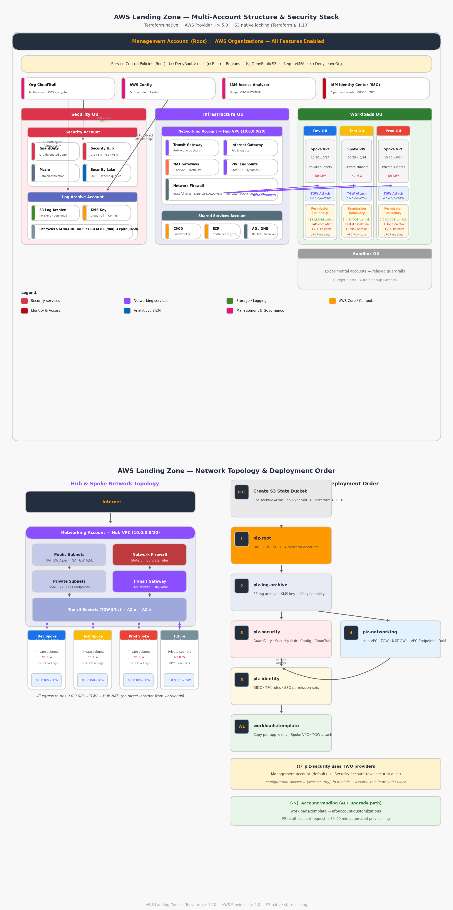
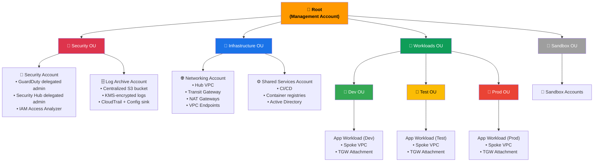
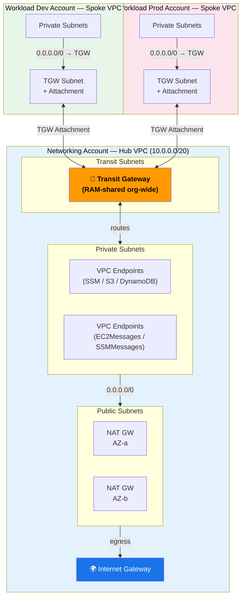
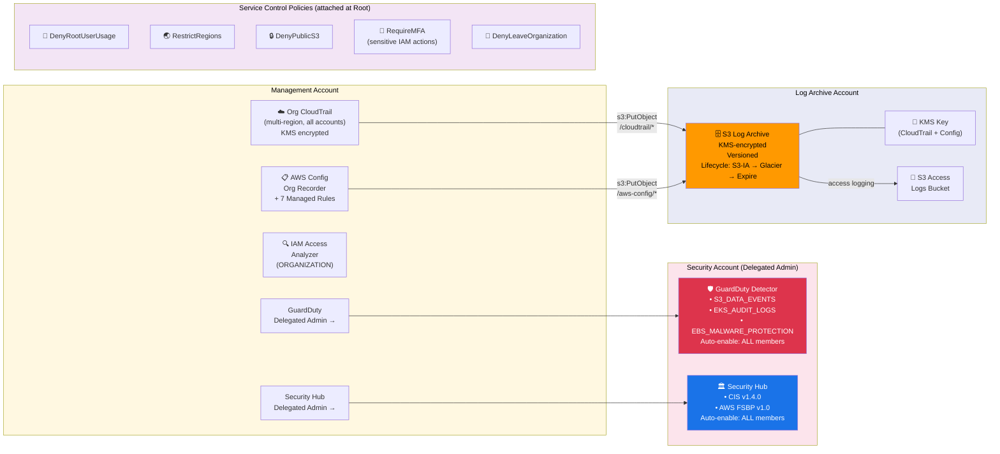
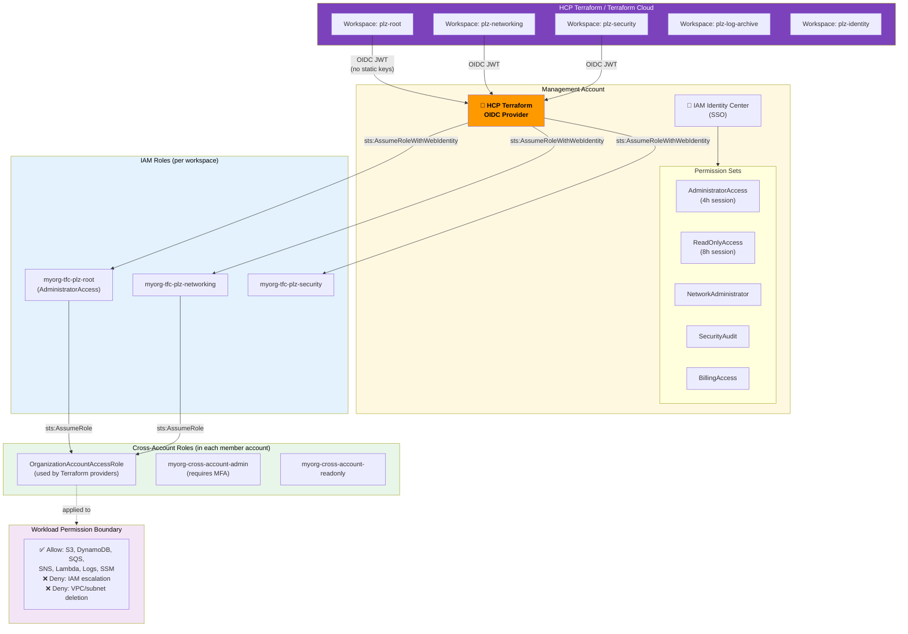
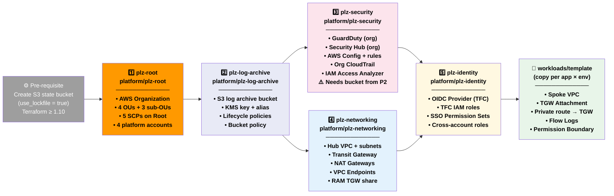

# AWS Landing Zone — Complete Technical Reference

> **Codebase:** `c:\Projects_IAC\AWS\terraform`
> **Pattern source:** HashiCorp Validated Patterns — Build AWS LZ with Terraform
> **Terraform:** ≥ 1.10 | **AWS Provider:** ~> 5.0 | **S3 native locking:** `use_lockfile = true`

---

## Table of Contents

1. [Architecture Overview](#1-architecture-overview)
   - [1.1 AWS Organization Structure](#11-aws-organization-structure)
   - [1.2 Network Topology — Hub & Spoke](#12-network-topology--hub--spoke)
   - [1.3 Security & Logging Architecture](#13-security--logging-architecture)
   - [1.4 Identity & Access Architecture](#14-identity--access-architecture)
   - [1.5 Terraform Deployment Order](#15-terraform-deployment-order)
2. [Repository Structure](#2-repository-structure)
3. [Module Reference](#3-module-reference)
4. [Platform Layer Reference](#4-platform-layer-reference)
5. [Workload Template](#5-workload-template)
6. [Alignment with AWS Landing Zone Standards](#6-alignment-with-aws-landing-zone-standards)
7. [Workload Vending — AWS Account Factory for Terraform (AFT)](#7-workload-vending--aws-account-factory-for-terraform-aft)
8. [Deployment Runbook](#8-deployment-runbook)
9. [Security Controls Summary](#9-security-controls-summary)
10. [Gaps & Recommendations](#10-gaps--recommendations)

---

## 1. Architecture Overview

This codebase implements a **multi-account AWS Landing Zone** using Terraform. It follows a two-tier model:

**Platform Landing Zone (PLZ)** — A foundational, centrally managed layer owned by the platform team. It provides shared governance, networking, security, and identity services that all workload accounts inherit.

**Workload Landing Zone (WLZ)** — Isolated AWS accounts where application teams deploy their workloads. Each WLZ inherits PLZ guardrails automatically through SCPs, shared networking, and delegated security services.

### Architecture Diagram



> Regenerate: `python docs/generate_diagram.py`

---

### 1.1 AWS Organization Structure



---

### 1.2 Network Topology — Hub & Spoke



All spoke VPCs have **no internet gateway** — egress flows through the hub's NAT Gateways via the Transit Gateway, giving the platform team full inspection and control over all outbound traffic.

---

### 1.3 Security & Logging Architecture



---

### 1.4 Identity & Access Architecture



---

### 1.5 Terraform Deployment Order



---

## 2. Repository Structure

```
terraform/
├── modules/                        # Reusable, parameterised building blocks
│   ├── organizations/              # AWS Org, OUs, SCPs, account creation
│   ├── networking/                 # Hub VPC, TGW, NAT GWs, VPC Endpoints
│   ├── security/                   # GuardDuty, SecurityHub, Config, CloudTrail
│   ├── logging/                    # Centralized S3 log archive + KMS
│   └── identity/                   # OIDC, SSO permission sets, cross-account roles
│
├── platform/                       # One folder per platform account / deployment
│   ├── plz-root/                   # Step 1 — Management account, Org setup
│   ├── plz-log-archive/            # Step 2 — Log Archive account
│   ├── plz-security/               # Step 3 — Security account (+ management)
│   ├── plz-networking/             # Step 4 — Networking account
│   └── plz-identity/               # Step 5 — Identity & access (management)
│
├── workloads/
│   └── template/                   # Spoke VPC template — copy per app × env
│
└── LANDING_ZONE_GUIDE.md           # Extended documentation
```

**Design principle:** Each `platform/` folder is an independently deployable root module with its own S3 backend state file, its own provider configuration (including `assume_role`), and its own `terraform.tfvars.example`. This keeps blast radius small — a failed security apply cannot corrupt networking state.

---

## 3. Module Reference

### 3.1 `modules/organizations`

**Purpose:** Bootstraps the entire AWS Organizations structure — the single most critical module; everything else depends on it.

**What it creates:**

| Resource | Detail |
|---|---|
| `aws_organizations_organization` | Enables ALL features, SCP + Tag Policy types, and trusted access for 8 AWS services |
| Organizational Units | Security, Infrastructure, Workloads, Sandbox at root; Dev/Test/Prod under Workloads |
| `DenyRootUserUsage` SCP | Blocks `*` for any principal matching `arn:aws:iam::*:root` |
| `RestrictRegions` SCP | Uses `NotAction` to block all regional services outside `allowed_regions`; global services (IAM, Route 53, CloudFront, etc.) are excluded from the deny |
| `DenyPublicS3` SCP | Prevents `s3:PutObjectAcl` with public ACLs and blocks disabling the Public Access Block |
| `RequireMFAForSensitiveActions` SCP | Denies key IAM actions (create access key, deactivate MFA, update password policy) when `aws:MultiFactorAuthPresent = false` |
| `DenyLeaveOrganization` SCP | Prevents `organizations:LeaveOrganization` on all accounts |
| Platform accounts | security, log-archive, networking, shared-services — each placed in its correct OU |

**Key design decisions:**
- All 5 SCPs attach at **root** (not per OU). This gives universal coverage. Add OU-specific SCPs in addition, not instead.
- `lifecycle { ignore_changes = [email, name] }` on accounts prevents re-creation if names drift.
- `allowed_regions` uses a `NotAction` pattern rather than `Action` deny — this is the AWS-recommended approach because new global/IAM services should not be accidentally blocked.

**Inputs required:**

```hcl
org_name       = "myorg"             # used as resource name prefix
account_emails = {                   # unique email per account (AWS requirement)
  security        = "..."
  log_archive     = "..."
  networking      = "..."
  shared_services = "..."
}
```

---

### 3.2 `modules/networking`

**Purpose:** Deploys the hub VPC and Transit Gateway in the dedicated networking account. This is the central egress and inspection point for all workloads.

**What it creates:**

| Resource | Detail |
|---|---|
| Hub VPC | Single VPC, `10.0.0.0/20` default, DNS hostnames + support enabled |
| Public Subnets | 1 per AZ, computed via `cidrsubnet(hub_vpc_cidr, 4, index)` |
| Private Subnets | 1 per AZ, offset by `az_count` in the subnet calculation |
| Transit Subnets | 1 per AZ, for TGW ENIs only — no workloads here |
| Internet Gateway | Attached to hub VPC |
| NAT Gateways | 1 per AZ (HA), each with its own Elastic IP |
| Route Tables | Public (→ IGW), Private per-AZ (→ same-AZ NAT + spoke supernet via TGW), Transit |
| Transit Gateway | BGP ASN `64512`, DNS support, ECMP enabled, default route table association/propagation |
| TGW Hub Attachment | Hub VPC connected to TGW via transit subnets |
| Private route for spoke supernet | `10.0.0.0/8 → TGW` on all private route tables |
| AWS RAM share | TGW shared with entire AWS Organization (`allow_external_principals = false`) |
| VPC Flow Logs | ALL traffic → CloudWatch Logs, KMS-encrypted, configurable retention |
| KMS key | Dedicated key for flow logs with CloudWatch Logs service principal in key policy |
| Gateway Endpoints | S3 and DynamoDB (no cost, no security group needed) |
| Interface Endpoints | SSM, SSMMessages, EC2Messages (enables Session Manager without internet) |
| Endpoint Security Group | Allows port 443 from VPC CIDR only |

**Subnet CIDR allocation (default `10.0.0.0/20`, `az_count = 2`):**

```
10.0.0.0/24  — public  AZ-a
10.0.1.0/24  — public  AZ-b
10.0.2.0/24  — private AZ-a
10.0.3.0/24  — private AZ-b
10.0.4.0/24  — transit AZ-a
10.0.5.0/24  — transit AZ-b
```

**Important outputs to note:**
- `transit_gateway_id` — pass this to every workload spoke template
- `nat_gateway_public_ips` — add these to external vendor allowlists (all outbound traffic exits through these IPs)
- `organization_arn` — required input, comes from `plz-root` outputs

---

### 3.3 `modules/security`

**Purpose:** Enables and configures the three pillars of AWS detective controls — GuardDuty, Security Hub, and AWS Config — at the organization level, plus an immutable organization-wide CloudTrail.

**Split-account provider pattern:**

This module uses `configuration_aliases = [aws.security]`. Resources are split across two accounts:

| Account | Resources |
|---|---|
| **Management** (default provider) | `aws_guardduty_organization_admin_account`, `aws_securityhub_organization_admin_account`, `aws_cloudtrail`, `aws_accessanalyzer_analyzer`, AWS Config recorder/delivery/rules, IAM password policy |
| **Security** (`aws.security` alias) | `aws_guardduty_detector`, all `aws_guardduty_detector_feature`, `aws_guardduty_organization_configuration`, all `aws_guardduty_organization_configuration_feature`, `aws_securityhub_account`, `aws_securityhub_organization_configuration`, both standards subscriptions |

This split is mandatory. GuardDuty/SecurityHub delegated admin configuration **must** run from within the delegated admin account, not the management account.

**GuardDuty features enabled:**

| Feature resource | AWS feature name | Org auto-enable |
|---|---|---|
| `aws_guardduty_detector_feature.s3_data_events` | `S3_DATA_EVENTS` | ALL members |
| `aws_guardduty_detector_feature.eks_audit_logs` | `EKS_AUDIT_LOGS` | ALL members |
| `aws_guardduty_detector_feature.ebs_malware_protection` | `EBS_MALWARE_PROTECTION` | ALL members |

**AWS Config rules deployed:**

| Rule | Identifier | Purpose |
|---|---|---|
| required-tags | `REQUIRED_TAGS` | Enforces Environment, Owner, CostCenter tags |
| encrypted-volumes | `ENCRYPTED_VOLUMES` | EBS volumes must be encrypted |
| s3-bucket-server-side-encryption-enabled | `S3_BUCKET_SERVER_SIDE_ENCRYPTION_ENABLED` | S3 SSE mandatory |
| s3-account-level-public-access-blocks-periodic | `S3_ACCOUNT_LEVEL_PUBLIC_ACCESS_BLOCKS_PERIODIC` | Account-level S3 public access block |
| root-account-mfa-enabled | `ROOT_ACCOUNT_MFA_ENABLED` | Root MFA required |
| iam-password-policy | `IAM_PASSWORD_POLICY` | 14-char min, complexity, 90-day max age, 24 reuse prevention |
| vpc-flow-logs-enabled | `VPC_FLOW_LOGS_ENABLED` | All VPCs must have flow logs |

**CloudTrail:** Organization trail, multi-region, with data events for all S3 objects and all Lambda functions. Log file validation enabled. KMS-encrypted using the Log Archive account key.

---

### 3.4 `modules/logging`

**Purpose:** Creates the immutable, centralized log archive that receives CloudTrail and AWS Config data from every account in the organization. This account should have tightly restricted access — even administrators should rarely log into it.

**S3 bucket design:**

```
Bucket name: {name_prefix}-log-archive-{account_id}
Encryption:  SSE-KMS (dedicated KMS key, key rotation enabled)
Versioning:  Enabled
Public access block: All 4 settings = true

Lifecycle:
  Day 0-30:   STANDARD        (hot storage)
  Day 30-90:  STANDARD_IA     (infrequent access, 40% cheaper)
  Day 90+:    GLACIER         (archival, 85% cheaper)
  Day 365:    Expire          (configurable via log_retention_days)
  Noncurrent versions: Expire after 30 days
```

**Bucket policy allows:**
- `cloudtrail.amazonaws.com` → `s3:PutObject` at `/cloudtrail/*` (requires `bucket-owner-full-control` ACL)
- `cloudtrail.amazonaws.com` → `s3:GetBucketAcl`
- `config.amazonaws.com` → `s3:PutObject` at `/aws-config/*` (scoped to `aws:SourceOrgID`)
- ELB service account → `s3:PutObject` at `/elb-logs/*` (for future ALB access logging)
- Explicit DENY for all non-HTTPS requests (`aws:SecureTransport = false`)

**KMS key policy grants:**
- Root account: full KMS permissions
- `cloudtrail.amazonaws.com`: GenerateDataKey, Decrypt
- `config.amazonaws.com`: GenerateDataKey, Decrypt

**Access logs:** A separate bucket (`{prefix}-access-logs-{account_id}`) with AES-256 encryption captures all S3 API calls to the log archive bucket itself (90-day retention).

---

### 3.5 `modules/identity`

**Purpose:** Establishes the identity plane — how humans and automation authenticate and what they can do across all accounts.

**HCP Terraform OIDC (dynamic credentials):**

```hcl
# Eliminates all long-lived AWS access keys for Terraform pipelines
aws_iam_openid_connect_provider "tfc"
  url = "https://app.terraform.io"
  client_id_list = ["aws.workload.identity"]

# Per-workspace IAM role with scoped OIDC trust
condition: app.terraform.io:sub = 
  "organization:{org}:project:{proj}:workspace:{ws}:run_phase:*"
```

Each workspace gets its own IAM role with a tight OIDC sub-claim condition. A compromised workspace token cannot be used to assume a different workspace's role.

**IAM Identity Center permission sets:**

| Permission Set | Policy | Session Duration | Use case |
|---|---|---|---|
| AdministratorAccess | AdministratorAccess | 4 hours | Break-glass, platform operations |
| ReadOnlyAccess | ReadOnlyAccess | 8 hours | Auditors, day-to-day browsing |
| NetworkAdministrator | job-function/NetworkAdministrator | 4 hours | Network team |
| SecurityAudit | SecurityAudit | 8 hours | Security team reviews |
| BillingAccess | job-function/Billing | 8 hours | Finance team |

**Cross-account roles:**

```hcl
# Admin role — requires MFA
aws_iam_role.cross_account_admin
  Condition: aws:MultiFactorAuthPresent = "true"
  Policy: AdministratorAccess

# Read-only role — no MFA requirement
aws_iam_role.cross_account_readonly
  Policy: ReadOnlyAccess
```

---

## 4. Platform Layer Reference

Each platform folder is a standalone Terraform root module. They share a common pattern:

```
platform/{name}/
├── backend.tf         # S3 backend + required_version + provider(s) with assume_role
├── variables.tf       # All input variables with types and descriptions
├── main.tf            # Single module call (thin orchestration layer)
├── outputs.tf         # Key outputs used by downstream platform layers
└── terraform.tfvars.example  # Reference values — copy to terraform.tfvars
```

### Deployment dependency chain

```
plz-root
  └─► plz-log-archive (needs: organization exists)
          └─► plz-security (needs: log_archive_bucket, kms_key_arn)
          └─► plz-networking (needs: organization_arn)
                  └─► plz-identity (no hard dependency, but logically last)
```

### Backend configuration (all layers)

```hcl
backend "s3" {
  bucket       = "REPLACE_ME-terraform-state"   # Pre-created manually
  key          = "platform/{layer}/terraform.tfstate"
  region       = "ap-southeast-2"
  encrypt      = true
  use_lockfile = true                            # Terraform ≥ 1.10, no DynamoDB needed
}
```

### Cross-account access pattern

Each platform layer (except `plz-root` and `plz-identity`) assumes `OrganizationAccountAccessRole` in the target account:

```hcl
provider "aws" {
  assume_role {
    role_arn = "arn:aws:iam::{account_id}:role/OrganizationAccountAccessRole"
  }
}
```

`OrganizationAccountAccessRole` is auto-created by AWS Organizations in every member account with `AdministratorAccess`, trusted by the management account. `plz-security` uses **two** providers — one for the management account and one (`aws.security`) for the security account.

---

## 5. Workload Template

**Location:** `workloads/template/`

This is the starting point for every application deployment. Copy this folder for each `{app} × {environment}` combination.

### What it creates per workload account

| Resource | Purpose |
|---|---|
| Spoke VPC | Private-only VPC, CIDR from variable |
| Private subnets (×AZ) | App subnets — no direct internet access |
| TGW subnets (×AZ) | Houses the TGW attachment ENIs |
| TGW VPC Attachment | Connects spoke to the hub TGW |
| Default route `0.0.0.0/0 → TGW` | Forces all egress through hub NAT |
| Default SG (deny-all) | Overrides AWS's default allow-all default security group |
| VPC Flow Logs | All traffic captured, 30-day CloudWatch retention |
| Permission Boundary IAM Policy | Limits blast radius of any role in this account |

### Permission Boundary (blast radius control)

```hcl
# What workload roles CAN do
Allow: s3:*, dynamodb:*, sqs:*, sns:*, lambda:*, logs:*, xray:*, ssm:GetParameter*

# What workload roles CANNOT do (even if AdministratorAccess is attached)
Deny:  iam:CreateUser, DeleteUser, AttachUserPolicy, PutUserPolicy, CreateAccessKey
Deny:  ec2:DeleteVpc, ModifyVpcAttribute, DeleteSubnet, DeleteRouteTable
```

### How to onboard a new workload

```bash
# 1. Copy template
cp -r workloads/template workloads/my-app-dev

# 2. Update backend key
# workloads/my-app-dev/backend.tf → key = "workloads/my-app/dev/terraform.tfstate"

# 3. Create tfvars
cp workloads/my-app-dev/terraform.tfvars.example \
   workloads/my-app-dev/terraform.tfvars

# 4. Fill in values
app_name            = "my-app"
environment         = "dev"
workload_account_id = "111122229999"   # Account from plz-root account vending
spoke_vpc_cidr      = "10.10.0.0/24"  # Non-overlapping with other spokes
transit_gateway_id  = "tgw-xxxx"      # From plz-networking outputs
owner               = "my-team"
cost_center         = "ABC-123"

# 5. Deploy
terraform -chdir=workloads/my-app-dev init
terraform -chdir=workloads/my-app-dev apply
```

---

## 6. Alignment with AWS Landing Zone Standards

### 6.1 What is an "AWS Landing Zone"?

AWS defines a landing zone as a well-architected, multi-account environment that follows AWS best practices across five pillars: **security, operations, networking, identity, and cost**. AWS provides three official implementations:

| Implementation | Description |
|---|---|
| **AWS Control Tower** | Managed, click-to-deploy LZ using CloudFormation StackSets. Simplest to start. |
| **AWS Landing Zone Accelerator (LZA)** | CDK-based, fully automated, highly configurable. Replaces the older "Landing Zone Solution". |
| **AWS Account Factory for Terraform (AFT)** | Terraform-native account vending machine built **on top of** Control Tower. |

**This codebase uses none of these — it is a custom, Terraform-native landing zone** following the HashiCorp Validated Patterns approach. This is a valid and mature pattern used by many enterprises. Here is how it compares:

---

### 6.2 Alignment Scorecard

| LZ Capability | AWS Requirement | This Codebase | Status |
|---|---|---|---|
| Multi-account structure | OUs reflecting business/security boundaries | Security, Infrastructure, Workloads, Sandbox OUs with sub-OUs | ✅ Fully aligned |
| Management account hardening | No workloads in management account | Management account only runs Org/Identity resources | ✅ Fully aligned |
| Preventive controls (SCPs) | SCPs at root and OU level | 5 SCPs at root: deny root, restrict regions, deny public S3, require MFA, deny leave org | ✅ Fully aligned |
| Detective controls | GuardDuty, SecurityHub, Config org-wide | All three enabled with delegated admin | ✅ Fully aligned |
| Centralized logging | Immutable, org-level CloudTrail + Config → dedicated log account | CloudTrail (org, multi-region) + Config → Log Archive S3 + KMS | ✅ Fully aligned |
| Network segmentation | Hub-spoke, no direct internet in workloads | Hub VPC + TGW + NAT, spoke VPCs have no IGW | ✅ Fully aligned |
| Least privilege identity | SSO with short-lived sessions, no long-lived keys | IAM Identity Center permission sets, OIDC for automation | ✅ Fully aligned |
| Encryption at rest | KMS for logs, state, SNS | KMS on log archive, flow logs, SNS topic | ✅ Fully aligned |
| Transit encryption | TLS enforced | S3 bucket policy denies non-HTTPS, CloudTrail log file validation | ✅ Fully aligned |
| Tagging governance | Required tags enforced | Config rule: Environment, Owner, CostCenter required | ✅ Fully aligned |
| Account vending | Automated account creation with guardrails | Manual account emails in tfvars — **no automation pipeline** | ⚠️ Partial |
| Workload isolation | Separate account per workload/environment | Template exists, but manual copy/apply per workload | ⚠️ Partial |
| Control Tower enrollment | AWS-managed baseline per account | Not integrated with Control Tower | ❌ Not present |
| Drift detection | Detect manual changes | No Control Tower or LZA drift remediation | ❌ Not present |
| Account customization pipeline | Automatic baseline on new accounts | No AFT-style customization pipeline | ❌ Not present |

**Overall verdict:** This codebase is **architecturally aligned** with AWS Landing Zone principles. The security posture, network topology, and governance controls match AWS recommendations. The main gap versus AWS-native tooling is **automated account vending and lifecycle management**, which is addressed in the next section.

---

### 6.3 Comparison with AWS Control Tower

| Aspect | Control Tower | This Codebase |
|---|---|---|
| Setup complexity | Low (console wizard) | Medium (Terraform expertise needed) |
| Customization | Limited (Customizations for Control Tower / CfCT) | Full (any Terraform resource) |
| Account vending | Account Factory (console/SC) or AFT | Manual (terraform apply per account) |
| Guardrails | AWS-managed preventive + detective (200+) | Custom SCPs + Config rules |
| State management | CloudFormation StackSets | Terraform S3 backend |
| IaC portability | Locked to CloudFormation/CfCT | 100% Terraform |
| Cost | No additional charge | No additional charge |
| Upgrade path | Managed by AWS | Self-managed |

If your organization requires **full Terraform control** and does not want to depend on CloudFormation StackSets, this custom LZ pattern is the right choice. If you need the managed guardrails catalog and simpler operations, adopt Control Tower and layer AFT on top.

---

## 7. Workload Vending — AWS Account Factory for Terraform (AFT)

### 7.1 What is AFT?

**AWS Account Factory for Terraform (AFT)** is AWS's official Terraform-based account vending machine. It sits on top of AWS Control Tower and provides a **GitOps pipeline** for account requests: a developer submits a pull request, and within 30–60 minutes a fully configured, guardrail-compliant AWS account is ready.

AFT is not a replacement for Control Tower — it is an extension of it. You must have Control Tower running first.

### 7.2 AFT Core Concepts

AFT uses **four Git repositories** as its interface:

```
┌─────────────────────────────────────────────────────────────────┐
│  Repo 1: aft-account-request                                    │
│  ─────────────────────────────────────────────────────────────  │
│  One .tf file per account request.                              │
│  Commit = account order. Merge = provision starts.             │
│                                                                 │
│  module "my_app_dev" {                                          │
│    source = "./modules/aft-account-request"                     │
│    control_tower_parameters = {                                 │
│      AccountEmail = "my-app-dev@example.com"                   │
│      AccountName  = "my-app-dev"                               │
│      ManagedOrganizationalUnit = "Workloads/Dev"               │
│      SSOUserEmail = "admin@example.com"                        │
│      SSOUserFirstName = "Admin"                                 │
│      SSOUserLastName = "User"                                   │
│    }                                                            │
│    account_tags = {                                             │
│      "Application" = "my-app"                                  │
│      "Environment" = "dev"                                      │
│    }                                                            │
│    change_management_parameters = {                             │
│      change_requested_by = "platform-team"                     │
│      change_reason = "New dev account for my-app"              │
│    }                                                            │
│    custom_fields = {                                            │
│      spoke_vpc_cidr = "10.10.0.0/24"                           │
│    }                                                            │
│  }                                                              │
└─────────────────────────────────────────────────────────────────┘

┌─────────────────────────────────────────────────────────────────┐
│  Repo 2: aft-global-customizations                              │
│  ─────────────────────────────────────────────────────────────  │
│  Terraform + Python applied to EVERY new account.              │
│  Put baseline things here:                                      │
│  • Delete default VPC                                           │
│  • Enable EBS encryption by default                             │
│  • Set IAM password policy                                      │
│  • Create baseline IAM roles                                    │
│  • Enable S3 Block Public Access at account level              │
└─────────────────────────────────────────────────────────────────┘

┌─────────────────────────────────────────────────────────────────┐
│  Repo 3: aft-account-customizations                             │
│  ─────────────────────────────────────────────────────────────  │
│  Terraform + Python applied per account TYPE (folder = type).  │
│  Example folder structure:                                      │
│  ├── workload-standard/   ← spoke VPC + TGW attachment         │
│  ├── workload-pci/        ← extra security controls            │
│  └── sandbox/             ← relaxed guardrails                 │
└─────────────────────────────────────────────────────────────────┘

┌─────────────────────────────────────────────────────────────────┐
│  Repo 4: aft-account-provisioning-customizations                │
│  ─────────────────────────────────────────────────────────────  │
│  Step functions / Lambda hooks for pre/post provisioning.      │
│  Rarely needed. Example use: register account in CMDB.         │
└─────────────────────────────────────────────────────────────────┘
```

### 7.3 AFT Pipeline (End-to-End Flow)

```
Developer                  AFT Pipeline                      AWS
─────────                  ────────────                      ───

1. PR to                ─► CodePipeline triggered
   aft-account-request     │
   (new .tf file)          ├─► Terraform validate + plan
                           │
2. Merge PR             ─► CodePipeline: terraform apply
                           │
                           ├─► Control Tower Account Factory
                           │   • Creates new AWS account
                           │   • Enrolls in Control Tower
                           │   • Applies CT guardrails
                           │   • Creates OrganizationAccountAccessRole
                           │
                           ├─► AFT: Global Customizations
                           │   • Assumes role in new account
                           │   • Runs aft-global-customizations TF
                           │   (delete default VPC, baseline IAM, etc.)
                           │
                           ├─► AFT: Account Customizations
                           │   • Identifies account type from tags
                           │   • Runs matching customization folder TF
                           │   (spoke VPC + TGW attachment ← your template)
                           │
                           └─► SNS notification: "Account ready"

~30-60 minutes total
```

### 7.4 Integrating This Codebase with AFT

The `workloads/template/` folder in this codebase maps directly to AFT's **account customizations**. Here is how to wire it in:

**Step 1 — Install AFT on top of Control Tower:**

```hcl
# In a new management account Terraform config
module "aft" {
  source  = "aws-ia/control_tower_account_factory/aws"
  version = "~> 1.0"

  ct_management_account_id    = var.management_account_id
  log_archive_account_id      = var.log_archive_account_id
  audit_account_id            = var.security_account_id
  aft_management_account_id   = var.aft_management_account_id   # new account
  ct_home_region              = "ap-southeast-2"

  terraform_version      = "1.10.0"
  terraform_distribution = "oss"

  # Point at your account-request repo
  vcs_provider                                  = "github"
  account_request_repo_name                     = "myorg/aft-account-request"
  global_customizations_repo_name               = "myorg/aft-global-customizations"
  account_customizations_repo_name              = "myorg/aft-account-customizations"
  account_provisioning_customizations_repo_name = "myorg/aft-account-provisioning-customizations"
}
```

**Step 2 — Move `workloads/template` into AFT account customizations:**

```
aft-account-customizations/
└── workload-standard/
    ├── terraform/
    │   ├── main.tf         ← contents of workloads/template/main.tf
    │   ├── variables.tf    ← modified to read from AFT custom_fields
    │   └── backend.tf      ← AFT manages backend automatically
    └── api_helpers/
        └── python/         ← optional pre/post hooks
```

**Step 3 — Pass workload parameters via `custom_fields` in account request:**

```hcl
# aft-account-request/accounts/my-app-dev.tf
module "my_app_dev" {
  source = "./modules/aft-account-request"

  control_tower_parameters = {
    AccountEmail              = "my-app-dev@myorg.com"
    AccountName               = "myorg-my-app-dev"
    ManagedOrganizationalUnit = "Workloads/Dev"
    SSOUserEmail              = "platform-team@myorg.com"
    SSOUserFirstName          = "Platform"
    SSOUserLastName           = "Team"
  }

  account_tags = {
    "Application"  = "my-app"
    "Environment"  = "dev"
    "Owner"        = "app-team"
    "CostCenter"   = "ABC-123"
  }

  # These become Terraform variables in account customizations
  custom_fields = {
    account_type       = "workload-standard"          # selects customization folder
    spoke_vpc_cidr     = "10.10.0.0/24"
    transit_gateway_id = "tgw-0abc123def456"          # from plz-networking output
    az_count           = "2"
  }
}
```

**Step 4 — Read `custom_fields` in the account customization:**

```hcl
# aft-account-customizations/workload-standard/terraform/variables.tf
variable "spoke_vpc_cidr"     { type = string }
variable "transit_gateway_id" { type = string }
variable "az_count"           { type = number }

# AFT injects custom_fields as environment variables prefixed TF_VAR_
# e.g., TF_VAR_spoke_vpc_cidr=10.10.0.0/24
```

### 7.5 AFT vs Current Manual Vending — Comparison

| Capability | Current (manual) | With AFT |
|---|---|---|
| Request method | Edit tfvars, run terraform apply | Git pull request |
| Approval workflow | Whoever has CLI access | GitHub PR review + merge |
| Time to new account | 30+ min manual | 30–60 min automated |
| Audit trail | Terraform state | Git history + CodePipeline logs |
| Consistency | Depends on engineer | Guaranteed — same pipeline always |
| Baseline enforcement | Manual reminder | Automatic via global customizations |
| Self-service | No | Yes (teams PR their own accounts) |
| Control Tower guardrails | No | Yes (CT enrolls each account) |
| Account count scaling | Hard (manual copy) | Easy (one file per account) |

### 7.6 Global Customizations to Add (Apply to Every Account)

These should go in `aft-global-customizations` and run on every account including platform accounts:

```hcl
# 1. Delete the default VPC (reduces attack surface)
resource "aws_default_vpc" "delete" {
  force_destroy = true
}

# 2. Enable EBS encryption by default
resource "aws_ebs_encryption_by_default" "this" {
  enabled = true
}

# 3. Enable S3 Block Public Access at account level
resource "aws_s3_account_public_access_block" "this" {
  block_public_acls       = true
  block_public_policy     = true
  ignore_public_acls      = true
  restrict_public_buckets = true
}

# 4. Set IAM account alias
resource "aws_iam_account_alias" "this" {
  account_alias = "${var.org_name}-${var.account_name}"
}

# 5. Enable Security Hub in new account (will be auto-aggregated to security account)
resource "aws_securityhub_account" "this" {
  enable_default_standards = false
}
```

---

## 8. Deployment Runbook

### Prerequisites

```bash
# 1. Install Terraform ≥ 1.10
terraform version

# 2. Configure AWS credentials for the management account
aws configure --profile management
export AWS_PROFILE=management

# 3. Pre-create the Terraform state bucket (ONE TIME only)
aws s3api create-bucket \
  --bucket myorg-terraform-state \
  --region ap-southeast-2 \
  --create-bucket-configuration LocationConstraint=ap-southeast-2

aws s3api put-bucket-versioning \
  --bucket myorg-terraform-state \
  --versioning-configuration Status=Enabled

aws s3api put-bucket-encryption \
  --bucket myorg-terraform-state \
  --server-side-encryption-configuration \
  '{"Rules":[{"ApplyServerSideEncryptionByDefault":{"SSEAlgorithm":"AES256"}}]}'

aws s3api put-public-access-block \
  --bucket myorg-terraform-state \
  --public-access-block-configuration \
  "BlockPublicAcls=true,IgnorePublicAcls=true,BlockPublicPolicy=true,RestrictPublicBuckets=true"

# No DynamoDB table needed — Terraform 1.10+ uses S3 conditional writes
```

### Step-by-Step Apply

```bash
# Replace REPLACE_ME-terraform-state with your actual bucket name in all backend.tf files

# ── STEP 1: Org structure (management account) ──────────────────
cd platform/plz-root
cp terraform.tfvars.example terraform.tfvars
# Edit terraform.tfvars with your org_name and account emails
terraform init
terraform plan
terraform apply

# ── STEP 2: Log archive bucket ──────────────────────────────────
cd ../plz-log-archive
cp terraform.tfvars.example terraform.tfvars
# Set log_archive_account_id from step 1 outputs
terraform init && terraform apply

# ── STEP 3 + 4: Security and Networking (can run in parallel) ───
# Terminal A:
cd ../plz-security
cp terraform.tfvars.example terraform.tfvars
# Set security_account_id, log_archive_bucket, kms_key_id, kms_key_arn from step 2
terraform init && terraform apply

# Terminal B:
cd ../plz-networking
cp terraform.tfvars.example terraform.tfvars
# Set networking_account_id, organization_arn from step 1
terraform init && terraform apply

# ── STEP 5: Identity ─────────────────────────────────────────────
cd ../plz-identity
cp terraform.tfvars.example terraform.tfvars
# Set tfc_organization, tfc_workspaces, trusted_account_arns
terraform init && terraform apply

# ── WORKLOADS (repeat per app × env) ────────────────────────────
cp -r workloads/template workloads/my-app-dev
# Update backend key and terraform.tfvars
# Set spoke_vpc_cidr (non-overlapping), transit_gateway_id from step 4
cd workloads/my-app-dev && terraform init && terraform apply
```

---

## 9. Security Controls Summary

### Preventive Controls (SCPs — enforce before any API call)

| Control | Coverage | What it blocks |
|---|---|---|
| DenyRootUserUsage | All accounts | All API calls using root credentials |
| RestrictRegions | All accounts | Any service call outside allowed regions (global services exempt) |
| DenyPublicS3 | All accounts | Public S3 ACLs and disabling public access block |
| RequireMFAForSensitiveActions | All accounts | Key IAM mutations without MFA |
| DenyLeaveOrganization | All accounts | Accounts removing themselves from the Org |

### Detective Controls (post-event alerting)

| Control | Scope | What it detects |
|---|---|---|
| GuardDuty | All accounts (auto-enabled) | Threat detection: crypto mining, credential exfiltration, C2 communication, EBS malware |
| Security Hub | All accounts (auto-enabled) | Aggregated findings + CIS 1.4.0 + FSBP compliance scoring |
| AWS Config | Management account | 7 rules: tags, EBS encryption, S3 encryption, S3 public block, root MFA, password policy, VPC flow logs |
| CloudTrail | All accounts (org trail) | Immutable API audit log, S3 + Lambda data events |
| IAM Access Analyzer | Organization scope | External access to resources, unused permissions |
| VPC Flow Logs | Hub + all spoke VPCs | Network traffic visibility for forensics |

### Encryption

| Data | Encryption |
|---|---|
| Log Archive S3 bucket | SSE-KMS (dedicated key, auto-rotation) |
| CloudTrail logs | KMS (Log Archive key) |
| VPC Flow Logs (CloudWatch) | KMS (dedicated flow logs key) |
| SNS Config notifications | KMS |
| Terraform state | SSE-AES256 (S3 bucket encryption) |

---

## 10. Gaps & Recommendations

### High Priority

| Gap | Recommendation |
|---|---|
| No automated account vending | Adopt AFT (Section 7) or build a CodePipeline around the workload template |
| No global account baselines | Add `aft-global-customizations` equivalent: delete default VPC, enable EBS encryption by default, S3 account-level public access block |
| CloudTrail missing in member accounts | Org trail covers management events, but add Config recorder to member accounts or enable AWS Config org-wide delegation |
| No budget alerts | Add `aws_budgets_budget` per account with SNS alerts to prevent runaway spend |
| Security Hub findings have no notification path | Wire SecurityHub → EventBridge → SNS → Slack/email/ticketing for `FAILED` findings with CRITICAL/HIGH severity |

### Medium Priority

| Gap | Recommendation |
|---|---|
| TFC workspace IAM roles use `AdministratorAccess` | Scope down to least-privilege per workspace (networking needs VPC/TGW permissions, not IAM/S3) |
| No spoke VPC CIDR registry | Track allocated CIDRs in a shared data file or use AWS IPAM to prevent CIDR overlaps across workloads |
| No tagging for subnets for EKS/ELB | Add `kubernetes.io/role/internal-elb = 1` tags to private subnets if EKS workloads are planned |
| Workload permission boundary is hardcoded | Parameterize the permission boundary per environment (prod should be stricter than dev) |
| No cross-region disaster recovery | Add a secondary region with replicated log archive bucket and cross-region GuardDuty |

### Low Priority / Future

| Gap | Recommendation |
|---|---|
| No AWS Service Catalog | Publish the workload template as a Service Catalog product so teams self-service without direct Terraform access |
| No cost allocation tags enforcement via Tag Policy | Add an AWS Organizations Tag Policy alongside the Config rule for stronger enforcement |
| No AWS Firewall Manager | For large-scale WAF/SG rule management across accounts, add Firewall Manager in the security account |
| No AWS RAM for other shared resources | Extend the RAM sharing pattern to share Route 53 Resolver rules, License Manager configurations |
