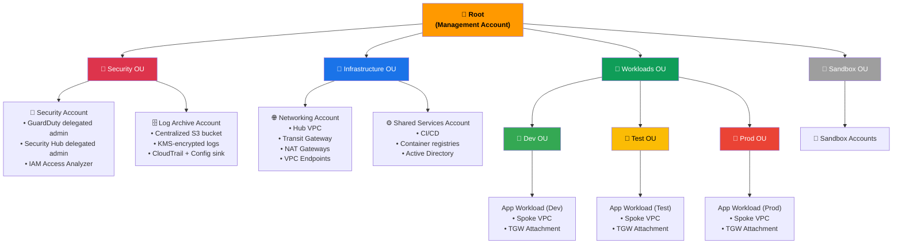
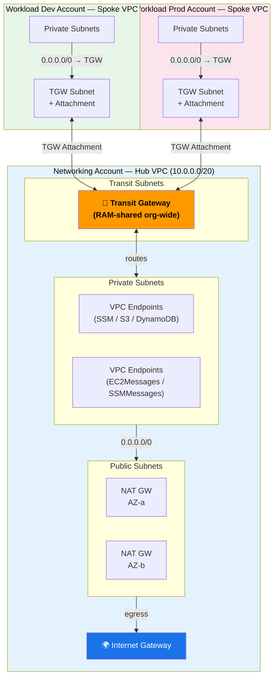
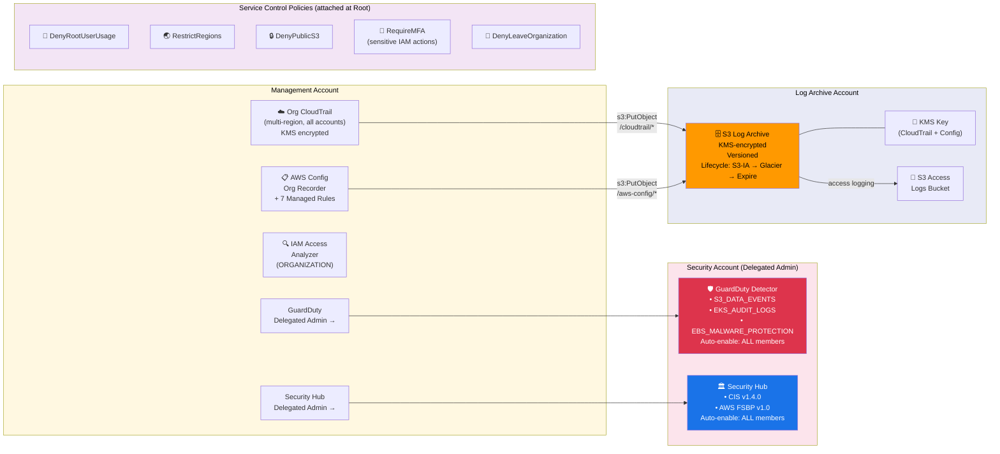
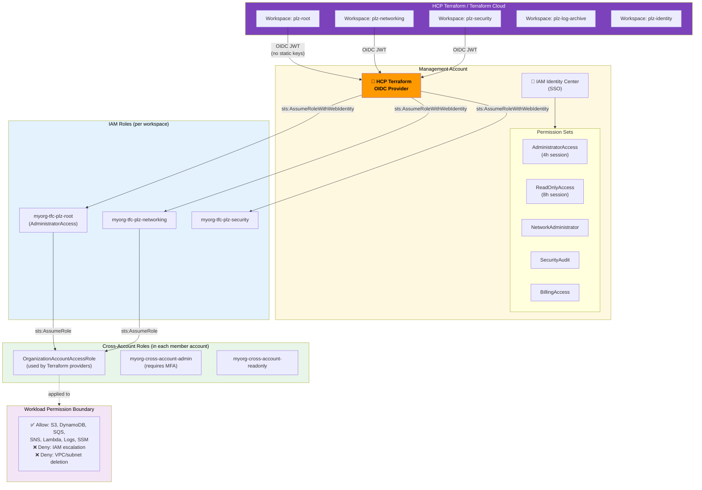
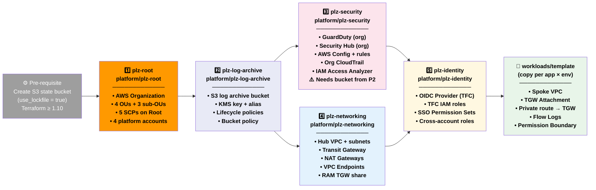

# AWS Landing Zone — Architecture Diagrams

---

## 1. AWS Organization Structure

---

## 2. Network Topology — Hub & Spoke

---

## 3. Security & Logging Architecture

---

## 4. Identity & Access Architecture

---

## 5. Terraform Deployment Order

